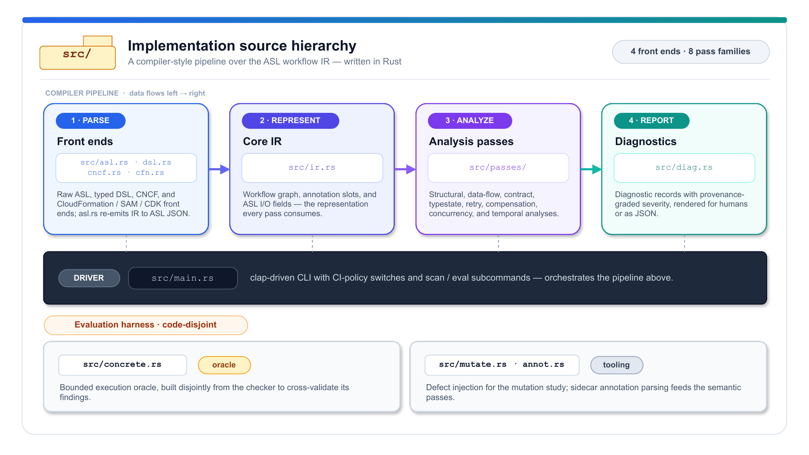

# Safe Serverless Workflow Orchestration (ICSOC 2026)

This repository contains the paper, the **StepCheck** tool, the evaluation corpus,
the evaluation harness, and the AWS round-trip scripts for the paper *"Sound Data-Flow
Verification for Safe Serverless Workflow Orchestration: Provenance, Typestate,
Concurrency, and Compensation."*

StepCheck is a static verifier for AWS Step Functions / Amazon States Language (ASL)
workflows. Its centrepiece is the first **sound data-flow / field-provenance analysis**
of the ASL I/O-processing pipeline — an abstract interpretation over a may-present
lattice of document shapes that flags missing-field references with no false positives,
going beyond the JSONPath *syntax* that `statelint`/`asl-validator` check. Around it
StepCheck runs seven further checks — structural well-formedness, typed contracts,
**typestate** (business-protocol) conformance, **retry safety** (idempotency),
**concurrency interference** (Parallel/Map shared writes), **retry/timeout budget**, and
**Saga compensation completeness** — all before deployment, compiling verified workflows
back to executable ASL. Because raw ASL omits task semantics, StepCheck pairs sound
*native* checks with a lightweight *annotation* layer whose defaults are *inferred* from
task names and resource bindings.

## Implementation source hierarchy



## Layout

| Path | What |
|---|---|
| `paper/main.pdf` | the compiled paper (LNCS, **~20 pp incl. references** after adding the data-flow / concurrency / temporal contributions — **trim to the ICSOC page limit before submission**). Sources in `paper/sections/`; the evaluation chart is generated by `eval/figures.ipynb` (matplotlib) → `paper/figures/eval-figure.pdf`; bibliography in `paper/references.bib` (verified — see `paper/bib-verification.md`). |
| `stepcheck/` | the tool, in Rust (3,692 LOC). `src/{ir,asl,cncf,dsl,annot,diag,mutate,main}.rs` and `src/passes/{structural,dataflow,contract,typestate,retry,compensation,concurrency,temporal}.rs` (eight passes). Three frontends (ASL, typed DSL, CNCF Serverless Workflow) lower to one IR; the passes are unchanged across formats. `corpus/dataflow/` holds the data-flow demonstrators. |
| `corpus/asl/` | 193 real Step Functions workflows mined from public AWS repos. `corpus/manifest.json` records provenance; `corpus/gold-labels.json` is the inference gold set (23 workflows, 147 tasks; new workflows double-labelled, kappa 1.00/0.745). `corpus/dsl/` holds the typed-DSL worked example. |
| `corpus/cncf/` | 66 real CNCF Serverless Workflow examples (second corpus). `corpus/cncf-typed/` holds the typed order workflow whose declared JSON Schemas let the contract check run natively (no inference). |
| `eval/` | the evaluation harness and results: `SUMMARY.md`, `results.json` (E2/E3/E5), `results-dataflow.json` (E10 typed-tier data-flow recall, `eval --strict-input`), `scan-asl.json` (per-file in-the-wild diagnostics), `inference_accuracy.json` (E4), `baseline-statelint.json` + `statelint_baseline.js` (E9, six-class statelint baseline), `asl2bpmn/encode.js` + `asl2bpmn-summary.json` + `bpmn-baseline.json` (WS-D BPMN baseline setup and verifier availability), `gold-labels-human-{A,B}.json` + `score-human-gold.js` (human-gold warning precision, inter-annotator kappa, RQ2 accuracy), `stats.tex` (E1), `fixpoint-stats.json` (data-flow fixpoint round/bound utilisation across both corpora, `fixpoint-stats`). |
| `infra/` | the AWS round-trip (E7): Express, Standard, and live `.waitForTaskToken` callback scripts plus captured execution evidence/history. Summary: `eval/aws-roundtrip-modes.json`. |
| `PLAN.md` | the implementation plan / design rationale. |

## Build & run the tool

```bash
cd stepcheck && cargo build --release
BIN=target/release/stepcheck

# verify a real workflow (with inference)
$BIN check ../corpus/asl/<wf>.asl.json --infer

# the typed-DSL worked example (valid vs reordered)
$BIN demo order      | $BIN check /dev/stdin --annot ../corpus/dsl/order.sidecar.toml
$BIN demo order-bad  | $BIN check /dev/stdin --annot ../corpus/dsl/order.sidecar.toml   # 5 errors

# reproduce the evaluation
$BIN stats ../corpus/asl                 # E1 corpus characterization
$BIN eval  ../corpus/asl --infer         # E2 in-the-wild + E3 mutation study + E5 timing
node ../eval/inference_accuracy.js       # E4 inference accuracy vs gold
$BIN fixpoint-stats ../corpus/asl ../corpus/cncf ../corpus/dsl > ../eval/fixpoint-stats.json  # data-flow fixpoint round/bound utilisation (termination)
node ../eval/asl2bpmn/encode.js ../corpus/asl --limit 30 --out ../eval/asl2bpmn/out --summary ../eval/asl2bpmn-summary.json  # WS-D BPMN baseline setup
node ../eval/asl2bpmn/run_baselines.js --summary ../eval/asl2bpmn-summary.json --out ../eval/bpmn-baseline.json  # records BProVe/BPMN Analyze availability or raw runs
```

## Continuous integration & packaging

- **CI** (`.github/workflows/ci.yml`): builds and runs the full test suite on Linux,
  macOS, and Windows on every push and pull request (`cargo build`/`cargo test` gate;
  `node eval/check_repro.js` replays the deterministic fixpoint claims; `cargo fmt`/
  `cargo clippy` advisory).
- **Release** (`.github/workflows/release.yml`): pushing a `vX.Y.Z` tag builds a
  self-contained binary for Linux x86_64/aarch64, macOS x86_64/arm64, and Windows
  x86_64, attaches them to the GitHub release, and publishes the crate to
  **crates.io** and the wrapper package to **npm**.
- **Install**: `cargo install stepcheck` (Rust) or `npm install -g @nimrod-f/stepcheck`
  (the `npm/` wrapper downloads the matching prebuilt binary and exposes the `stepcheck`
  command; the npm package is scoped because the unscoped name collides with an existing
  package). Both honour the same exit-code contract, so a Rust- or Node-centric CI adds
  StepCheck as a build gate with one line.

### Use StepCheck as a CI gate

A copy-pasteable GitHub Actions step that gates a pull request exactly like a compiler or linter —
it fails the build on any **error** (add `--deny-warnings` to also fail on inferred warnings once a
workflow is annotated):

```yaml
# .github/workflows/verify-workflows.yml
name: Verify Step Functions
on: [pull_request]
jobs:
  stepcheck:
    runs-on: ubuntu-latest
    steps:
      - uses: actions/checkout@v4
      - run: npm install -g @nimrod-f/stepcheck        # or: cargo install stepcheck
      - name: Verify every workflow definition
        run: |
          for f in $(git ls-files '*.asl.json'); do
            stepcheck check "$f" --infer || exit 1     # exit 0 clean · 1 error · 2 parse failure
          done
```

Publishing is gated on two optional repository secrets, `CARGO_REGISTRY_TOKEN` and
`NPM_TOKEN`; the release jobs skip themselves when a token is absent. The release
repository that hosts the downloadable binaries is set in `stepcheck/Cargo.toml`
(`repository`) and baked into the npm installer (`npm/install.js`); end users can
override the latter with `STEPCHECK_REPO=owner/repo` only if hosting the binaries
elsewhere.

## Headline results (all reproducible)

- **193** real workflows analysed; **99** flagged in the wild. The data-flow analysis
  fires **0** false positives on the default native run (soundness); the conservative
  overwriting-write rule fires **0** in the wild, while cross-child composition adds **2**
  SC5003 warnings; the temporal analysis adds **33** findings (SC6001 unbounded
  `waitForTaskToken` callbacks).
- Mutation study: **616** injected defects across six classes, **100%** detection.
  Baseline `statelint` detects structural (166/166) and broken-binding (140/141) but
  **0** of unsafe retry, missing compensation, concurrency, or temporal — **306/616 (50%)**.
- Hard-mutant study (operator–check independence): one boundary variant per class
  (`--hard`), still a genuine defect. Recall maps where each check's power ends rather than
  confirming it — data-flow/concurrency/temporal drop to **0** at their ⊤-boundary (sound
  silence, not a false negative), compensation is caught by the sibling **SC4010** not the
  operator's **SC4001**, retry degrades to **0.69**, structural stays exact at **1.00**, and the
  contract break escapes SC1003 but is caught by the schema validators. See `eval/results-hard-mutants.json`.
- Data-flow provenance (SC1101): **0/193** false positives on the default native run;
  native + typed demonstrators in `corpus/dataflow/`; typed-tier missing-field recall
  **88/126 (70%)** with `--result-shapes`.
- Inference accuracy vs agreement-checked gold (23 wf, 137 labelled tasks): **70%** idempotency,
  **87%** persistence (≈80% coverage). In-the-wild warning precision vs human gold (κ 0.89/0.99):
  **92%** overall (46/50), **89%** for compensation warnings (SC4001).
- Verification cost: **≈39 µs**/workflow mean on the 193-workflow AWS sample corpus; real industrial set **≈91 µs**/workflow; AWS Solutions workflows/artifacts **≈0.28 ms**/workflow; **0** runtime overhead.
- AWS round-trip: verified workflows deployed and executed on real Step Functions →
  `SUCCEEDED` in Express synchronous mode, Standard asynchronous mode with a durable 24-event
  history, and Standard live `.waitForTaskToken` callback mode resumed by external `SendTaskSuccess`
  with a durable 30-event history.
- Cross-format: a CNCF Serverless Workflow frontend (added with **no change to the IR or
  any pass**) parses all **66** spec examples; the typed contract check runs natively on
  CNCF-declared JSON Schemas (`stepcheck check corpus/cncf-typed/order-bad.yaml`).

## Reproduce the AWS round-trip (optional; creates & deletes resources)

```bash
bash infra/deploy_run.sh            # Express synchronous run
bash infra/deploy_run_standard.sh   # Standard async run + durable history
bash infra/deploy_run_callback.sh   # Standard live callback + SendTaskSuccess
bash infra/teardown.sh              # delete created state machines + Lambdas
```
